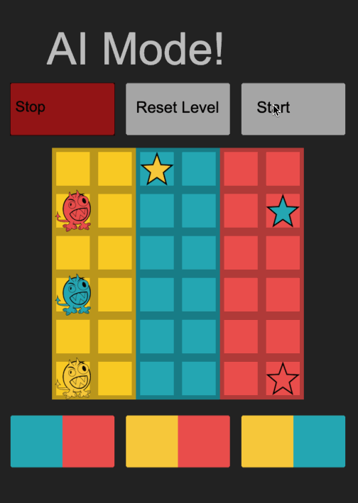

# Thesis Puzzle

This is a puzzle game where you use the abuility to swap colors to traverse twords a goal.

The goal of this puzzle is to move each monster to the star with the same color. Each monster can only move on its own color. You can swap the colors a limited ammount of time per level. (example of swap: Make all red squares blue)

Get each monster to the goal to move on. Finish all three levels to win.

This is the output of Ai_solver.py being animated in the game.

 
